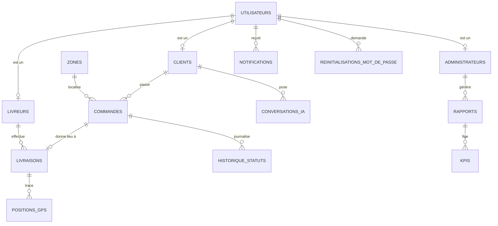

# Phase 3 : base de données PostgreSQL

## Installation (Windows, macOS ou Linux)

1. Installer PostgreSQL 13 ou plus (pgAdmin est inclus sous Windows).
2. Créer l'utilisateur et la base (dans psql ou l'outil « Query Tool » de pgAdmin) :
   ```sql
   CREATE ROLE smartdelivery LOGIN PASSWORD 'votre_mot_de_passe';
   CREATE DATABASE smartdelivery OWNER smartdelivery;
   ```
3. Dans `backend/` :
   ```bash
   npm install
   cp .env.example .env        # puis compléter DATABASE_URL et ADMIN_*
   npm run db:init             # schéma + zones + paramètres de tarification
   npm run db:admin            # crée le premier administrateur
   npm run test:db             # 32 vérifications, aucune donnée conservée
   ```
   `npm run db:reset` supprime et recrée tout (développement uniquement).

## Modèle entité-relation



## Répartition des responsabilités

| La base garantit (triggers et contraintes) | Le backend décide (phase 4) |
|---|---|
| Qu'une transition de statut est valide | Quel rôle a le droit de la déclencher |
| Qu'une commande naît au statut NOUVELLE | Le calcul de la distance et du montant |
| Qu'une livraison vise une commande validée et un livreur actif et disponible | Le choix du livreur (manuel ou automatique) |
| Que le contenu d'une commande est figé après validation | Les notifications envoyées à chaque étape |
| Que le GPS n'est accepté que pendant EN_COURS | La fréquence d'envoi des positions |
| Que tout changement de statut est historisé avec son auteur | La transmission de l'auteur (`SET LOCAL app.utilisateur_id`) |
| Qu'aucun mot de passe en clair n'est stocké | Le hachage bcrypt (coût 12) |

## Codes d'erreur métier (utilisés par l'API pour renvoyer un message clair)

| Code | Signification |
|---|---|
| SD001 | Transition de statut interdite |
| SD002 | Statut exigeant une livraison associée |
| SD003 | Commande non modifiable après validation |
| SD004 | Affectation invalide (commande non validée ou livreur indisponible) |
| SD005 | Statut de livraison modifié hors commande |
| SD006 | Position GPS hors livraison en cours |
